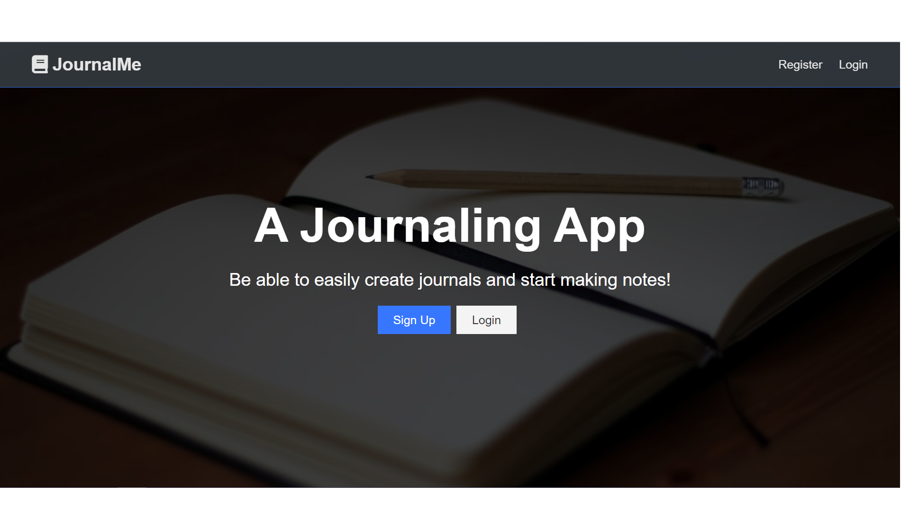
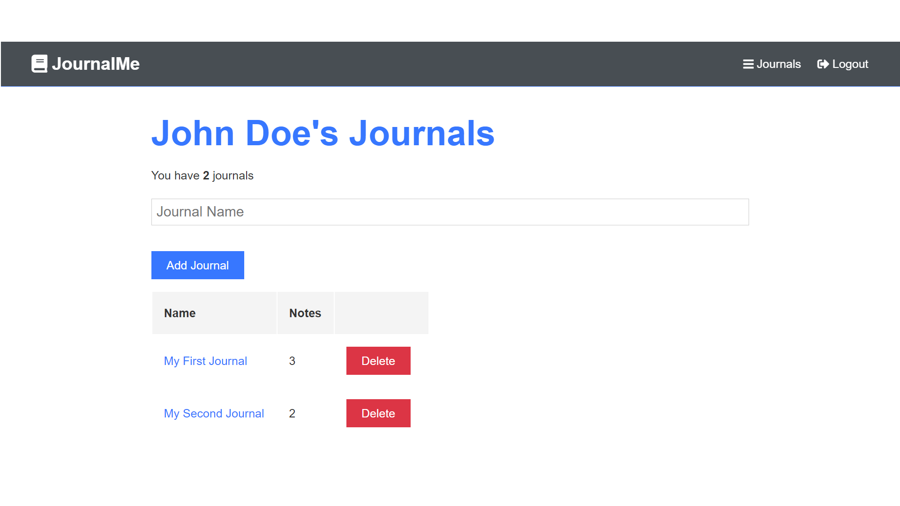
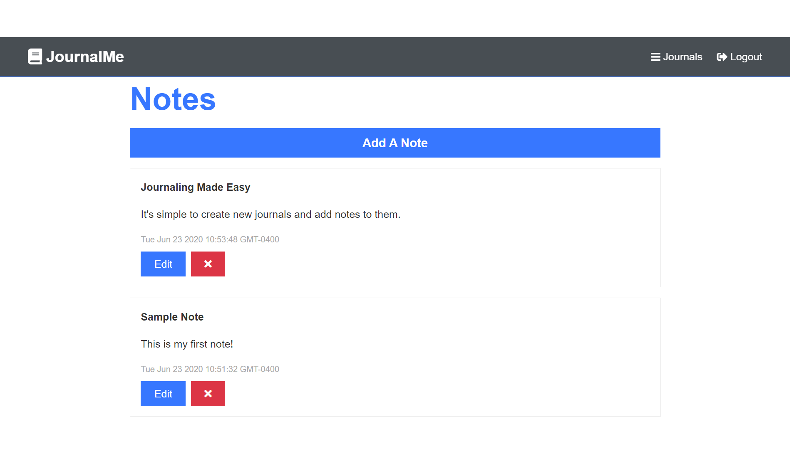

# JournalMe 📔

> A journaling app

This is a MERN stack application. It includes authentication and interacting with journals and notes.







---

# Quick Start 🚀

## Add a config.env file in the config folder with the following

```
PORT = 4000
MONGO_URI = <your_MongoDB_Atlas_uri_with_credentials>
JWT_SECRET_KEY = secret
```

## Install server dependencies

```
npm install
```

## Install client dependencies

```
cd client
npm install
```

## Run both Express and React from root

```
npm run dev
```

Check in browser on [http://localhost:3000](http://localhost:3000)
